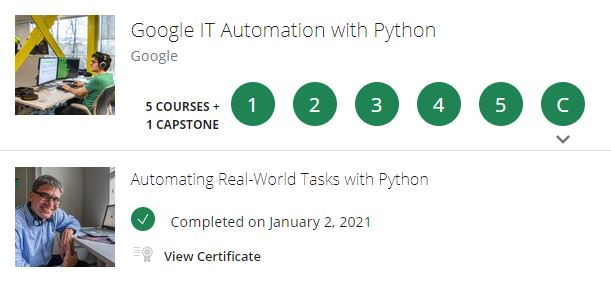
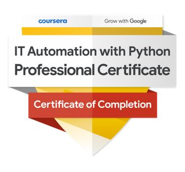

# Capstone - Google IT Automation with Python Professional Course

These repository contains the scripts which I have used for the final capstone project for the Google IT Automation with Python professional Course Series.
The series contains 5 courses and 1 final capstone project.

 

The 7 scripts are as follows, and are used in this order:
	
	1. changeImage.py
	2. supplier_image_upload.py
	3. run.py
	4. emails.py
	5. reports.py
	6. report_email.py
	7. health_check.py

Also adding here the badge that I got after completing the course. Man, what a challenge.
Course definitely felt insurmountable as I moved towards harder assignments. Some of the Qwiklabs I plan to re-do because while it was indeed a struggle, 
I enjoyed every part of it.

Plus the feeling of closing the dozen tabs in your browser after your code works was just, wow.
Almost like nirvana.

 

